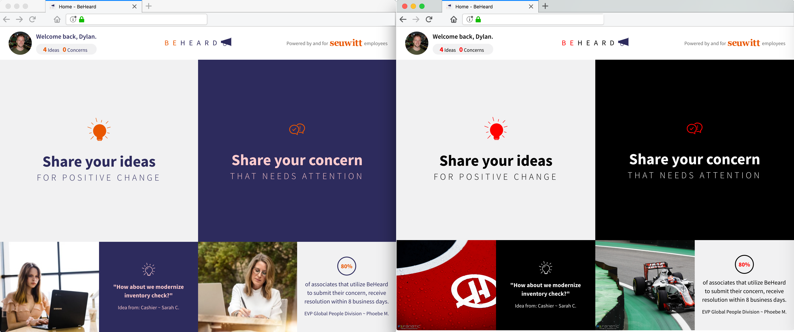
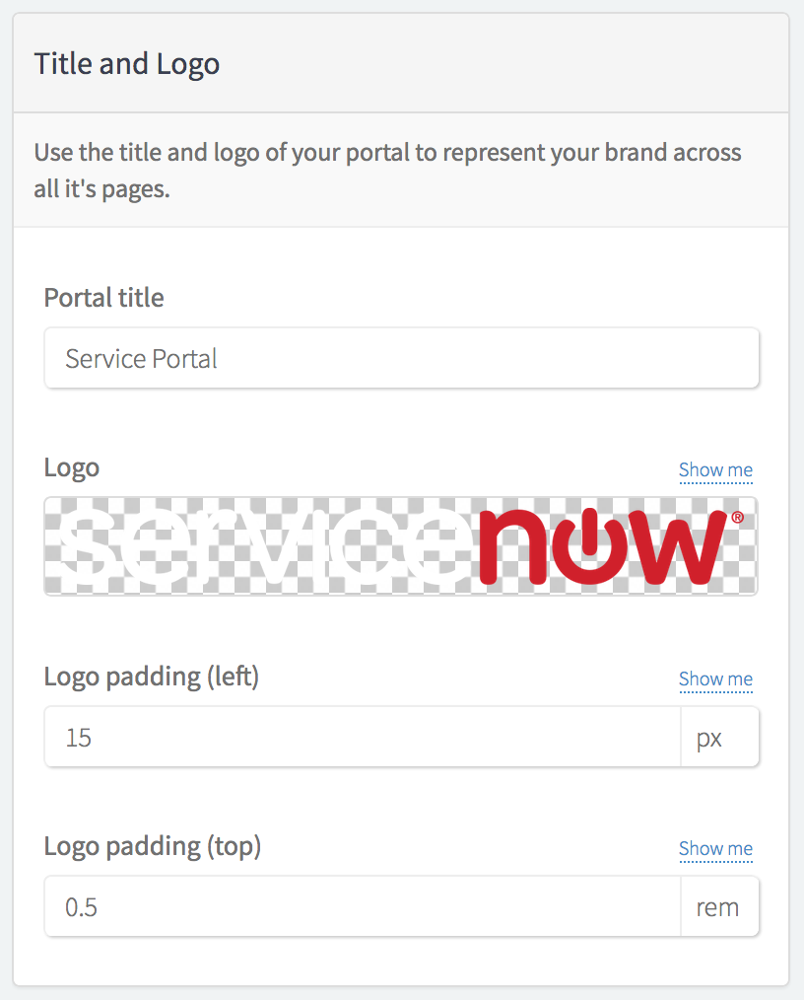
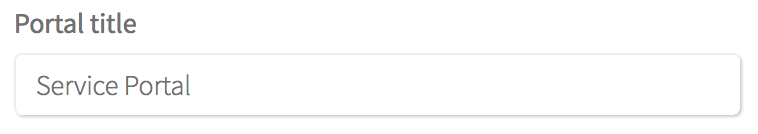
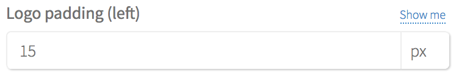
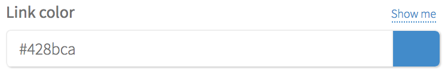

Advanced Branding Editor
==================
The Advanced Branding Editor application allows developers to define branding options for custom portals, and allow their configuration by portal administrators in a user friendly interface similar to that of the regular Branding Editor.

The regular Branding Editor allows configuration of the out-of-box Service Portal, however the hard-coded "bootstrap" styles it offers configuration for is quite limiting when applied to custom portals, or other Service Portal's offered by product lines such as Human Resources or Customer Service Management. Advanced Branding Editor offers greater flexibility in this regard - developers can define as many variables as they want per portal, label them in a relevant way, and allow for simple configuration for any type of portal.

<strong>Note:</strong> This application is not an “install and go” solution for all portals. Instead, it must first be used by developers to make their portal’s branding customisable. After doing this, portal administrators can then configure the branding of that portal using the Advanced Branding Editor interface.

Advanced Branding Editor has many features, some of which are listed below:

- You can define a CSS selector per variable, and the "Show me" text will appear next to the variable. Hovering over this will highlight where in the preview that the styling will affect.
- Press the reset button to set the variable or field back to it's default state.
- Each variable group can have a different "Search" string, meaning that a different page can be shown rather than just the home page. This is helpful when the variable you're editing isn't used on the home page.

Screenshots
-------------------

Without any code, dramatically changing the branding of a custom portal took only a minute and a half:

Installaton
-------------------
1. Download the XML file containing the update set from the [platform-experience/advanced-branding-editor](https://github.com/platform-experience/advanced-branding-editor) Github repository.
2. Follow the instructions on the [ServiceNow Documentation](https://docs.servicenow.com/bundle/london-application-development/page/build/system-update-sets/task/t_SaveAnUpdateSetAsAnXMLFile.html#t_SaveAnUpdateSetAsAnXMLFile) to load the update set on your instance from the downloaded XML file.
3. Commit the update set by following the instructions on the [ServiceNow Documentation](https://docs.servicenow.com/bundle/london-application-development/page/build/system-update-sets/task/t_CommitAnUpdateSet.html).

How it works
-------------------

### Tables
There are two tables that contain the core configuration of the Advanced Branding Editor.

#### Branding Groups

These are groups of branding items.

For each group, a search string can be defined, and when you expand the group to edit it the preview will append that string to the URL of the portal, changing the page displayed in the preview. It is thus recommended to group items based on what pages they appear on.
 This is a useful feature when you have variables which are used in widgets not on the home page. 
 
#### Branding Items

The branding items table is a base table, and the **Fields** and **Variables** tables are both extended from it. You will never create records directly in this base table, instead you will create them in the extended tables.

### Process

Upon opening the Advanced Branding Editor, the two tables above are scanned for the relevant records related to the selected portal, and are displayed in the edit frame. The SASS Variables field from the selected portal is also loaded, and is scanned for the current values of the SASS variables.

Item Types
-------------------

In the current version, there are 5 different types of items you can define for configuration.

| Class    | Type   | Screenshot                            |
|----------|--------|---------------------------------------|
| SN Field    | Image  |     |
| SN Field    | String |    |
| SASS Variable | Image  |  |
| SASS Variable | Unit   |   |
| SASS Variable | Color  |  |

Effective use
-------------------
Given that the Advanced Branding Editor configures SASS variables, it is cruicial to it's effective use that the portal you are configuring makes use of SASS variables. It is also cruicial that where they are defined, that the `!default` flag is used on them, which means that they are able to be overridden if the variable is also declared in the portal's SASS. You can read more about the `!default` flag at [this StackOverflow post](https://stackoverflow.com/questions/17089717/how-to-overwrite-scss-variables-when-compiling-to-css).