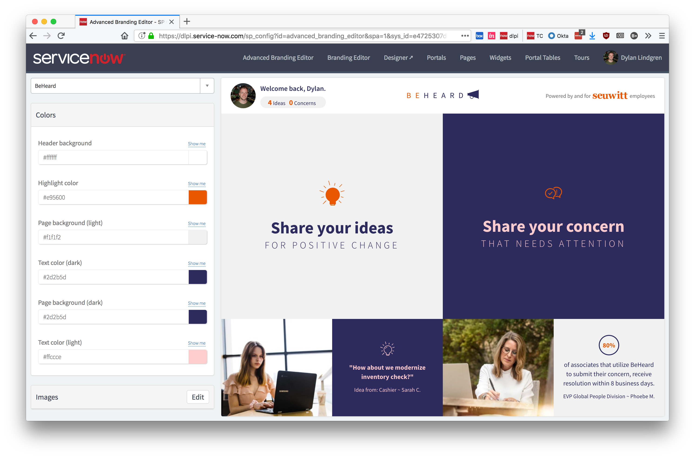
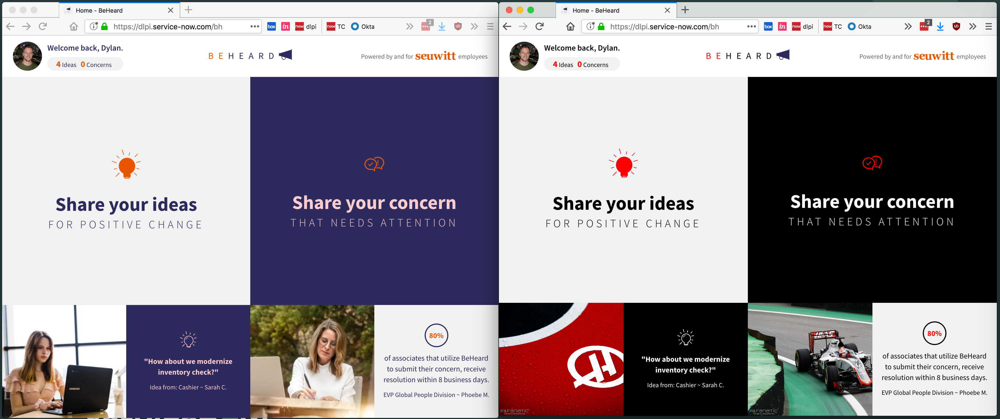

Advanced Branding Editor
==================
Advanced Branding Editor allows you to define branding options for custom portals, and configure them using a user friendly interface. The regular branding editor only allows configuration of the out-of-box Service Portal, and the hard-coded variables defined in there are not particularly relevant to custom portals, or other product Service Portal's such as HR or CSM.

Screenshots
-------------------

Installaton
-------------------
1. Open Studio on your ServiceNow instance.
2. Click the **Import From Source Control** button.
3. As the value of the URL field use the following:
	`https://github.com/platform-experience/advanced-branding-editor.git`
4. Press the **Import** button

How it works
-------------------

TODO

Usage
-------------------
The application comes with the branding groups and branding variables defined for the out-of-box Service Portal, however if you have any other portals then you will need to define groups and variables for these.
